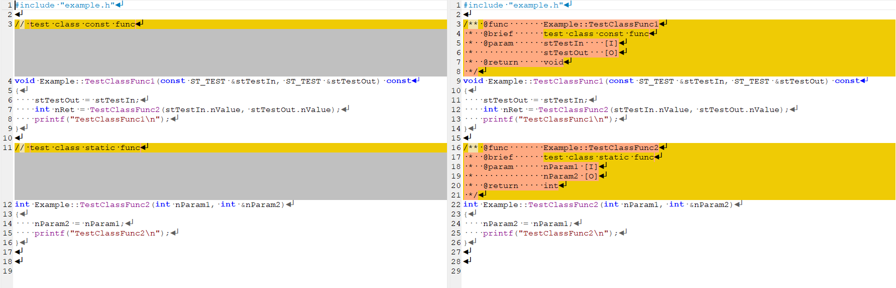

# Cpp-Annotation

​	Cpp-Annotation is a simple tool to auto generate C/Cpp function comment.

## Usage：

```
	./cpp_comment.py   [file/dir]
```

## Example：

### Input cpp file: example.cpp

```c++
#include "example.h"

// test class const func
void Example::TestClassFunc1(const ST_TEST &stTestIn, ST_TEST &stTestOut) const
{
  stTestOut = stTestIn;
  int nRet = TestClassFunc2(stTestIn.nValue, stTestOut.nValue);
  printf("TestClassFunc1\n");
}

// test class static func
int Example::TestClassFunc2(int nParam1, int &nParam2)
{
  nParam2 = nParam1;
  printf("TestClassFunc2\n");
}
```

### Run:  

```sh
./cpp_comment.py ./example.cpp
```

### Output cpp file: example.cpp_comment

```c++
#include "example.h"

/** @func       Example::TestClassFunc1
 *  @brief      test class const func
 *  @param      stTestIn    [I]
 *              stTestOut   [O]
 *  @return     void
 */
void Example::TestClassFunc1(const ST_TEST &stTestIn, ST_TEST &stTestOut) const
{
    stTestOut = stTestIn;
    int nRet = TestClassFunc2(stTestIn.nValue, stTestOut.nValue);
    printf("TestClassFunc1\n");
}

/** @func       Example::TestClassFunc2
 *  @brief      test class static func
 *  @param      nParam1 [I]
 *              nParam2 [O]
 *  @return     int
 */
int Example::TestClassFunc2(int nParam1, int &nParam2)
{
    nParam2 = nParam1;
    printf("TestClassFunc2\n");
}
```

###  Compare:


